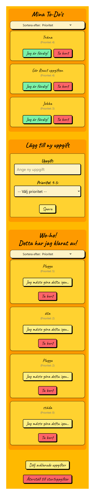
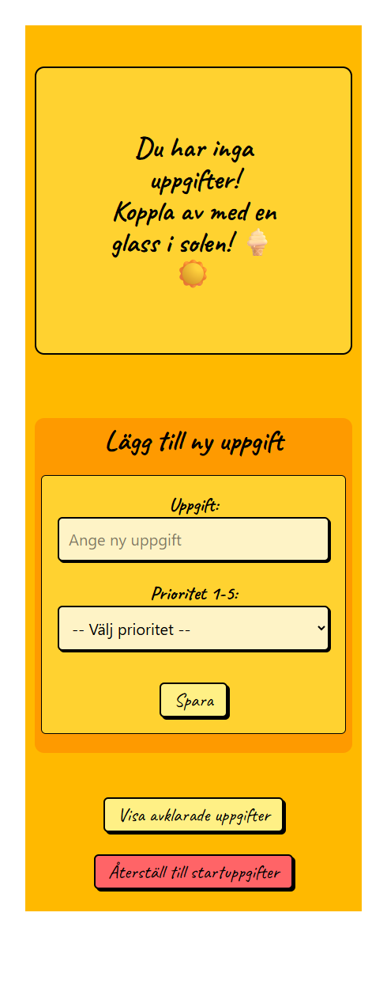

# Kurs: Javascript ramverk - React

## Utbildning till Frontend developer på Medieinstitutet

Detta är första gången jag arbetar med React och Tailwind. Se uppgiftsbeskrivning nedan.

Skapad av **Marie Lenvik** <br> https://github.com/M-Lenvik

## Innehållsförteckning

1. [Beskrivning av sidan](#-beskrivning-av-sidan--todo-app-i-react)
2. [Kom igång med projektet](#kom-igång-med-projektet)
   1. [Installera genom följande](#installera genom följande:)
3. [Tekniker som använts](#tekniker-som-använts)
4. [Uppgiftsbeskrivning](#uppgiftsbeskrivning)
   1. [Uppgiftskrav på G-nivå](#uppgiftskrav-på-g-nivå)
   2. [Uppgiftskrav på VG-nivå](#uppgiftskrav-på-vg-nivå)
5. [Bilder](#bilder)
6.  [ToDo Appen] (#todo-appen)
7. [Slutbetyg](#slutbetyg)

## 🔍 Beskrivning av sidan 📚 ToDo App i React

Sidan skall visa ett antal ToDo-punkter. Dessa visas på skärmen som en lista. När man gjort en ToDo kan användaren markera uppgiften som slutförd och uppgiften tas då bort från listan med aktiva ToDo's.

## Kom igång med projektet

**🛠️ Installera genom följande:**

1. Kloning av projektet
(https://github.com/Medieinstitutet/fed24d-the-last-todos-M-Lenvik)
- git clone [repo-url]
- cd [projektmapp]

2. Installera alla beroenden
Kör följande kommando för att installera alla nödvändiga paket enligt package.json:
Projektet är ett vite-projekt. D.v.s. du måste köra:

```shell
npm i
```

3. Starta localhost 
Projektet kör nu lokalt på localhost:5173, beroende på inställningar. Navigera till projektets rotmapp (cd fed24d-the-last-todos-M-Lenvik) och kör npm run dev.

💡 Tips: Se till att du har Node.js och npm installerat innan du börjar.

```shell
npm run dev
```

## Tekniker som använts
 <br>
 <br>
 <br>
 <br>
 <br>


## Uppgiftsbeskrivning
Sidan skall visa ett antal ToDo-punkter. Dessa visas på skärmen som en lista. När man gjort en ToDo kan användaren markera uppgiften som slutförd och uppgiften tas då bort från listan med aktiva ToDo's.

**Uppgiftskrav på G-nivå** <br>
- Skapa en hårdkodad lista med punkter att göra (hitta på egna punkter, dessa skall inte bara vara en text)
- Presentera listan på skärmen, helst med lite kontroll. Detta betyder i en html-struktur t.ex. i en ul/li-lista
- Implementera klickhändelse för att hantera borttagandet av en todo.
- Todo markeras som klar på skärmen och markeras som klar i javascript-listan.
- Ni behöver använda localStorage så att listan inte börjar om från början varje gång sidan används.
- Ni behöver använda er av en komponent.
- Ni behöver använda er av state med en lista med objekt.


**Uppgiftskrav på VG-nivå** <br>
- Alla punkter under G
- Kunna visa även klara händelser och klicka tillbaka den så att de blir oklara igen.
- Skapa ett formulär som tillåter att en användare skapar nya todos efterhand.
- Kunna sortera ordningen på dina todos.
- Implementera ett valfritt grafiskt ramverk, t.ex. tailwind eller material ui.
- Ni behöver ha minst tre komponenter.
- Ni måste använda Lifting State Up.

### Bilder
  - Bilder på den färdiga webbplatsen

<details>
<summary><strong>Skärmdumpar från webbplatsen</strong></summary>

#### ToDo Appen

 
</details>


## Slutbetyg
Betyg har ännu ej getts.